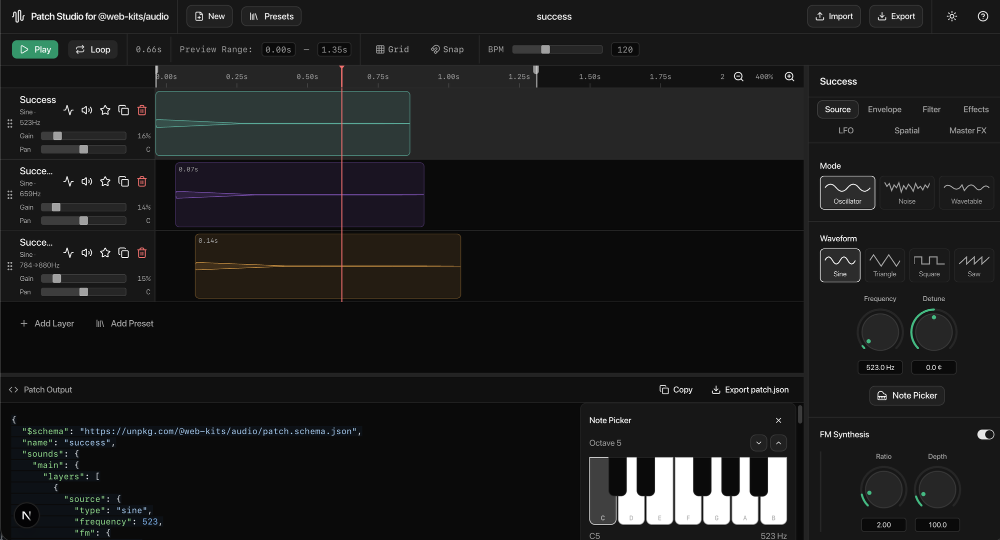

# Patch Studio for @web-kit/audio

[](LICENSE)



A web-based GUI for building synthesized sounds with the [`@web-kits/audio`](https://audio.raphaelsalaja.com) library. Design multi-layer sounds visually using a DAW-style timeline, tweak parameters in a sidebar, preview in real time, and export reusable patch files.

**[Try the live demo →](https://cameronfoxly.github.io/patch-studio/)**

## Features

- **Timeline editor** — Layer-based timeline with draggable waveform blocks, zoom, and playhead scrubbing
- **Envelope overlay** — Visual ADSR curves drawn directly on audio regions with draggable control points
- **Parameter sidebar** — Source, filter, envelope, effects, modulation, spatial, and gain/pan controls per layer
- **Interactive EQ graph** — Frequency response curves with draggable control points using Audio EQ Cookbook biquad coefficients
- **Preset library** — 252 sounds across 10 collections from the `@web-kits/audio` patch registry
- **Real-time playback** — Audio preview with loop and region controls, live parameter tweaking via throttled retrigger
- **Patch import/export** — Save and load `.json` patch files compatible with `@web-kits/audio`
- **Undo/redo** — Full state history with keyboard shortcuts
- **Dark/light mode** — Theme toggle with system preference detection

## Tech Stack

- [Next.js](https://nextjs.org) 16 (App Router, static export)
- [TypeScript](https://www.typescriptlang.org)
- [Tailwind CSS](https://tailwindcss.com) v4
- [shadcn/ui](https://ui.shadcn.com) (base-nova style, powered by `@base-ui/react`)
- [Zustand](https://zustand.docs.pmnd.rs) + [zundo](https://github.com/charkour/zundo) for state management with undo/redo
- [Lucide](https://lucide.dev) icons
- [@web-kits/audio](https://audio.raphaelsalaja.com) for sound synthesis

## Getting Started

### Prerequisites

- [Node.js](https://nodejs.org) 20 or later
- npm

### Installation

```bash
# Clone the repository
git clone https://github.com/CameronFoxly/patch-studio.git
cd patch-studio

# Install dependencies
npm install

# Start the dev server
npm run dev
```

Open [http://localhost:3000](http://localhost:3000) in your browser.

### Building

```bash
# Production build (static export)
npm run build

# Lint
npm run lint
```

The static site is output to the `out/` directory.

## Project Structure

```
src/
├── app/                  # Next.js app router (layout, page, globals.css)
├── components/
│   ├── toolbar/          # Top bar: transport, presets menu, file ops
│   ├── timeline/         # Timeline, layers, waveform canvas, envelope overlay
│   ├── sidebar/          # Parameter panels (source, filter, envelope, etc.)
│   ├── sequence/         # Step sequencer
│   ├── shared/           # Theme toggle, shared components
│   └── ui/               # shadcn/ui primitives + SliderInput
├── hooks/                # Audio engine, keyboard shortcuts
└── lib/
    ├── audio/            # Playback engine, patch converter
    ├── presets/           # Preset registry and runtime loader
    ├── store/            # Zustand store and slices
    └── types/            # TypeScript type definitions
public/
└── presets/              # Patch JSON files (10 collections, 252 sounds)
```

## Deployment

The project auto-deploys to [GitHub Pages](https://cameronfoxly.github.io/patch-studio/) on every push to `main` via the included [GitHub Actions workflow](.github/workflows/deploy.yml).

For self-hosting or Vercel deployment, deploy as-is — the `basePath` is only applied when `DEPLOY_TARGET=gh-pages` is set.

## Contributing

Contributions are welcome! Please read the [contributing guide](CONTRIBUTING.md) before submitting a pull request.

## License

This project is licensed under the [MIT License](LICENSE).
